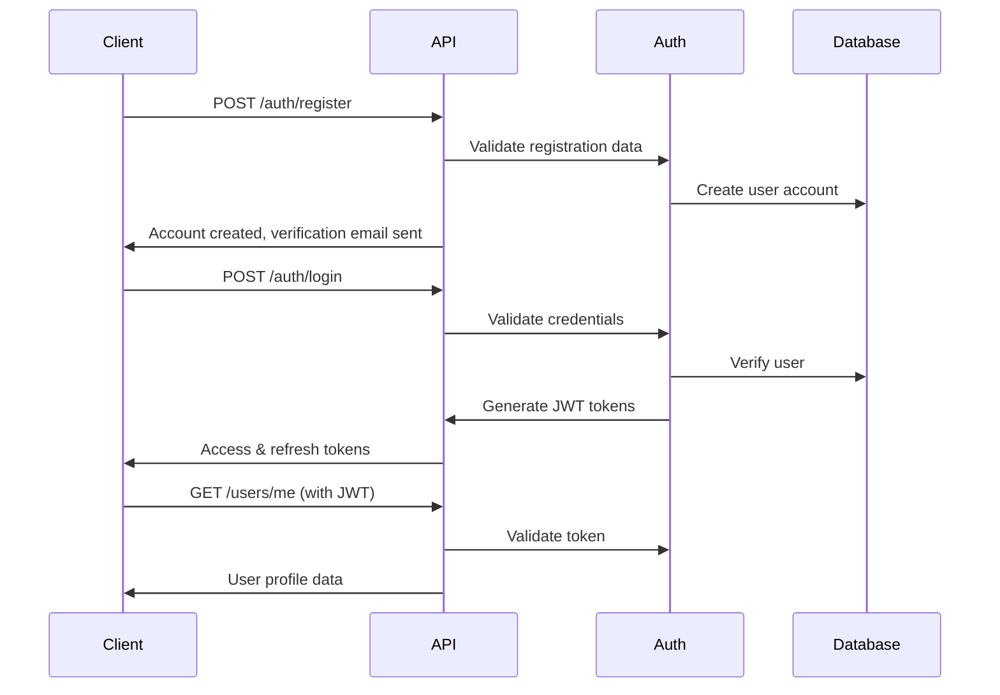

# 🚀 Stellr Academy Backend - Quick Start Guide

## Overview

The Stellr Academy Backend is a comprehensive learning platform API built with NestJS, TypeScript, and PostgreSQL. It provides a complete microservices architecture for managing courses, users, progress tracking, quizzes, certificates, and more.

## 🏗️ Architecture

```
Stellr Academy Backend
├── 🔐 Auth Service      - User registration, login, JWT tokens, OAuth
├── 👤 User Service      - Profile management, preferences, onboarding
├── 📚 Course Service    - Course catalog, lessons, categories
├── ✅ Progress Service  - Learning progress tracking, analytics
├── ❓ Quiz Service      - Quizzes, submissions, auto-grading
├── 🏆 Certificate Service - Certificate generation and management
├── 🔔 Notification Service - Email, SMS, push notifications
├── 🎥 Media Service     - Video hosting, PDF storage, access control
└── 🛠️ Common Services  - Shared utilities, logging, error handling
```

## 🚀 Quick Start

### Prerequisites

- Node.js 18+ and npm
- PostgreSQL 13+ database
- Redis (optional, for caching)
- Docker and Docker Compose (optional)

### Method 1: Local Development

1. **Clone and Install Dependencies**
   ```bash
   git clone https://github.com/Uvarsity-Learning-Platform/Stellr-Backend.git
   cd Stellr-Backend
   npm install
   ```

2. **Configure Environment**
   ```bash
   cp .env.example .env
   # Edit .env with your database and API keys
   ```

3. **Start Development Server**
   ```bash
   npm run start:dev
   ```

### Method 2: Docker Development

1. **Start with Docker Compose**
   ```bash
   docker-compose up -d
   ```

   This starts:
   - Backend API on `http://localhost:3000`
   - PostgreSQL database on `localhost:5432`
   - Redis cache on `localhost:6379`
   - pgAdmin on `http://localhost:8080` (dev profile)

## 📚 API Documentation

Once running, visit:
- **API Documentation**: `http://localhost:3000/api/v1/docs` (Swagger UI)
- **Health Check**: `http://localhost:3000/api/v1/health`

## 🔐 Authentication Flow



## 🎯 Core Features

### ✅ Implemented
- ✅ **Project Setup**: NestJS with TypeScript, Docker, environment configuration
- ✅ **Architecture**: Modular microservices design with dependency injection
- ✅ **Authentication**: JWT tokens, OAuth framework, secure password hashing
- ✅ **Database**: PostgreSQL with TypeORM, entity relationships, migrations
- ✅ **Logging**: Centralized logging with context and different levels
- ✅ **Error Handling**: Global error handling with consistent API responses
- ✅ **Health Checks**: Monitoring endpoints for application and dependencies
- ✅ **Testing**: Unit tests with Jest, e2e test framework
- ✅ **Documentation**: Comprehensive code comments and API documentation
- ✅ **Docker**: Production-ready containerization and orchestration

### 🚧 In Progress (Ready for Implementation)
- 🚧 **Full Auth Flows**: Complete registration, login, password reset, OAuth
- 🚧 **Course Management**: Course CRUD, lesson management, enrollment
- 🚧 **Progress Tracking**: Learning analytics, completion tracking, achievements
- 🚧 **Quiz System**: Quiz creation, submission handling, auto-grading
- 🚧 **Notifications**: Email templates, SMS integration, push notifications
- 🚧 **Media Handling**: File uploads, video streaming, secure access
- 🚧 **Certificates**: PDF generation, digital signatures, verification

## 🛠️ Development Commands

```bash
# Development
npm run start:dev          # Start with hot reload
npm run start:debug        # Start with debugging

# Building
npm run build              # Build for production
npm run start:prod         # Start production build

# Testing
npm run test               # Run unit tests
npm run test:watch         # Run tests in watch mode
npm run test:cov           # Run tests with coverage
npm run test:e2e           # Run end-to-end tests

# Database
npm run migration:generate # Generate database migration
npm run migration:run      # Run pending migrations
npm run migration:revert   # Revert last migration

# Docker
docker-compose up -d       # Start all services
docker-compose down        # Stop all services
docker-compose logs api    # View API logs
```

## 📁 Project Structure

```
src/
├── auth/                  # 🔐 Authentication & authorization
│   ├── controllers/       # HTTP endpoints for auth
│   ├── services/          # Business logic for auth, tokens, OAuth
│   ├── entities/          # Database models (RefreshToken)
│   ├── guards/            # Route protection (JWT, Local)
│   ├── strategies/        # Passport strategies
│   └── dto/               # Data transfer objects
├── user/                  # 👤 User management
│   ├── controllers/       # User profile endpoints
│   ├── services/          # User business logic
│   ├── entities/          # User database model
│   └── dto/               # User DTOs
├── course/                # 📚 Course management
├── progress/              # ✅ Progress tracking
├── quiz/                  # ❓ Quiz system
├── certificate/           # 🏆 Certificate generation
├── notification/          # 🔔 Notifications
├── media/                 # 🎥 Media management
├── common/                # 🛠️ Shared utilities
│   ├── controllers/       # Health check controller
│   ├── services/          # Logger, error handler
│   ├── guards/            # Shared guards
│   ├── interceptors/      # Request/response interceptors
│   └── dto/               # Common DTOs
└── database/              # 💾 Database configuration
```

## 🔧 Configuration

### Environment Variables

Key configuration options in `.env`:

```bash
# Application
NODE_ENV=development
PORT=3000
API_PREFIX=api/v1

# Database
DB_HOST=localhost
DB_PORT=5432
DB_USERNAME=stellr_user
DB_PASSWORD=stellr_password
DB_NAME=stellr_academy

# JWT Security
JWT_SECRET=your-super-secret-jwt-key
JWT_EXPIRES_IN=1d
JWT_REFRESH_SECRET=your-refresh-secret
JWT_REFRESH_EXPIRES_IN=7d

# OAuth
GOOGLE_CLIENT_ID=your-google-client-id
GOOGLE_CLIENT_SECRET=your-google-client-secret

# External Services
TWILIO_ACCOUNT_SID=your-twilio-sid
EMAIL_HOST=smtp.gmail.com
AWS_S3_BUCKET=your-s3-bucket
```

### Database Setup

1. **Create Database**
   ```sql
   CREATE DATABASE stellr_academy;
   CREATE USER stellr_user WITH PASSWORD 'stellr_password';
   GRANT ALL PRIVILEGES ON DATABASE stellr_academy TO stellr_user;
   ```

2. **Run Migrations**
   ```bash
   npm run migration:run
   ```

## 🔄 API Endpoints

### Authentication
- `POST /api/v1/auth/register` - User registration
- `POST /api/v1/auth/login` - User login
- `POST /api/v1/auth/refresh` - Refresh access token
- `POST /api/v1/auth/logout` - User logout
- `POST /api/v1/auth/verify-email` - Email verification
- `POST /api/v1/auth/verify-phone` - Phone verification

### Users
- `GET /api/v1/users/me` - Get current user profile
- `PUT /api/v1/users/me` - Update user profile
- `GET /api/v1/users/preferences` - Get user preferences
- `PUT /api/v1/users/preferences` - Update preferences

### Health & Monitoring
- `GET /api/v1/health` - Basic health check
- `GET /api/v1/health/detailed` - Detailed system info
- `GET /api/v1/health/ready` - Readiness probe
- `GET /api/v1/health/live` - Liveness probe

## 🧪 Testing

The project includes comprehensive testing:

- **Unit Tests**: Test individual components and services
- **Integration Tests**: Test module interactions
- **E2E Tests**: Test complete API workflows

```bash
# Run specific test suites
npm test -- --testPathPattern=auth
npm test -- --testPathPattern=user
npm test -- --testPathPattern=health

# Coverage reporting
npm run test:cov
open coverage/lcov-report/index.html
```

## 🚀 Deployment

### Production Checklist

1. **Environment Configuration**
   - [ ] Set `NODE_ENV=production`
   - [ ] Configure secure JWT secrets
   - [ ] Set up production database
   - [ ] Configure external services (email, SMS, storage)

2. **Security**
   - [ ] Enable HTTPS/TLS
   - [ ] Configure CORS for production domains
   - [ ] Set up rate limiting
   - [ ] Enable request validation

3. **Monitoring**
   - [ ] Set up application monitoring
   - [ ] Configure error tracking (Sentry)
   - [ ] Set up log aggregation
   - [ ] Configure health check endpoints

### Docker Production

```bash
# Build production image
docker build -t stellr-backend:latest .

# Run with production configuration
docker run -d \
  --name stellr-backend \
  -p 3000:3000 \
  --env-file .env.production \
  stellr-backend:latest
```

## 🤝 Contributing

1. **Development Setup**
   ```bash
   git clone https://github.com/Uvarsity-Learning-Platform/Stellr-Backend.git
   cd Stellr-Backend
   npm install
   cp .env.example .env
   npm run start:dev
   ```

2. **Code Standards**
   - Use TypeScript for all new code
   - Add comprehensive comments and documentation
   - Write unit tests for new features
   - Follow NestJS best practices
   - Use conventional commit messages

3. **Testing Requirements**
   - All new features must include tests
   - Maintain minimum 80% code coverage
   - E2E tests for new endpoints

## 📖 Additional Resources

- [NestJS Documentation](https://docs.nestjs.com/)
- [TypeORM Documentation](https://typeorm.io/)
- [PostgreSQL Documentation](https://www.postgresql.org/docs/)
- [JWT Best Practices](https://auth0.com/blog/a-look-at-the-latest-draft-for-jwt-bcp/)
- [Docker Best Practices](https://docs.docker.com/develop/best-practices/)

---

**Built with ❤️ by the Stellr Academy Team**